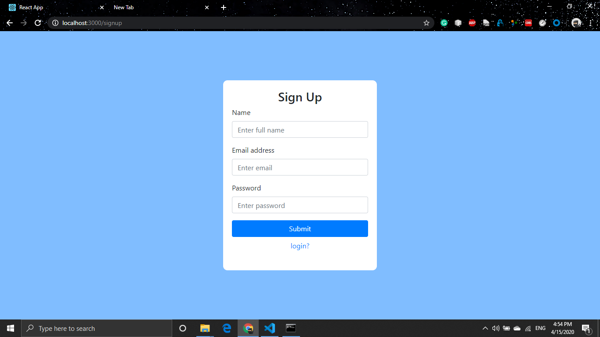

A web app similar to google keep functionality based on React.js.
## Problem statement 
-> Users should be able to create an account.

-> User should be able to able to login into the application with credentials (email/password)

    (you may want the credentials to persist on local session storage for the user to be able to log in with their account credentials)
    
-> Users should be able to create multiple task lists once logged in.

-> Each task list can have multiple tasks

-> Each task may have a image associated which should appear as thumbnail preview on the task list

-> Users should be able to delete/archive tasks or task lists.

-> The deleted/archived tasks/tasklists should be restorable.

-> the application state must persist on browser reload

-> Make the code available publicly on the GitHub.

## Solution
-> Users can create an account.

-> Users can login into the application with credentials. (email/password)

-> Users can able to create multiple task lists once logged in.

-> Each task list can have multiple tasks.

-> Each task may have a image associated which should appear as thumbnail preview on the task list.

-> Users can delete/archive tasks or task lists.

-> The deleted/archived tasks/tasklists are restorable.

-> the application state persist on browser reload.

## How to run

In the project directory, you can run:

### `npm start`

Runs the app in the development mode. 
Open [http://localhost:3000](http://localhost:3000) to view it in the browser.

## Demo screenshots

1. Signup Screen
   
